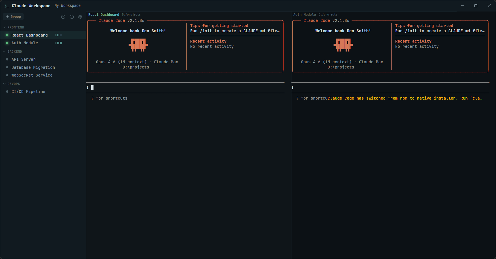
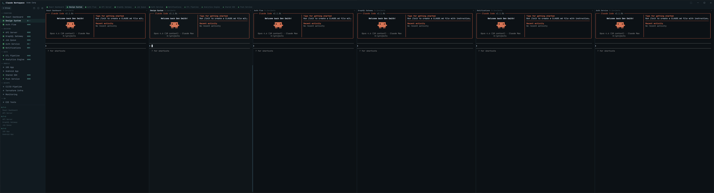

# Claude Workspace

Desktop app for managing multiple [Claude Code](https://docs.anthropic.com/en/docs/claude-code) sessions side by side.



### Wide display and multiple display ready



## Features

- **Multi-session workspace** — run multiple Claude Code sessions simultaneously in a tiled column layout
- **Session groups** — organize sessions into collapsible groups
- **Persistent sessions** — sessions resume automatically where you left off (powered by Claude Code's native session persistence)
- **Layout presets** — save and recall workspace layouts with keyboard shortcuts
- **Silence indicator** — visual progress bar shows how long since Claude's last output
- **Built-in terminal** — full PTY terminal emulation via xterm.js and node-pty
- **Customizable fonts** — bundled JetBrains Mono, Fira Code, and Hack, plus system fonts
- **Dark and light themes**
- **Cross-platform shortcuts** — Ctrl/Cmd aware for Windows and macOS

## Keyboard Shortcuts

| Action | Windows | macOS |
|--------|---------|-------|
| Open session | Click | Click |
| Add session to workspace | Ctrl + Click | Cmd + Click |
| Hide active session | Ctrl + F4 | Cmd + F4 |
| Save layout to slot | Ctrl + 0-9 | Cmd + 0-9 |
| Recall saved layout | Alt + 0-9 | Option + 0-9 |
| Copy terminal selection | Ctrl + C / Ctrl + Insert / Enter | Cmd + C / Cmd + Insert / Enter |
| Paste into terminal | Ctrl + V / Shift + Insert / Right Click | Cmd + V / Shift + Insert / Right Click |
| Newline without sending | Alt + Enter | Option + Enter |
| Close application | Alt + F4 | Option + F4 |

## Getting Started

### Prerequisites

- [Node.js](https://nodejs.org/) 18+
- [Claude Code CLI](https://docs.anthropic.com/en/docs/claude-code) installed and authenticated

### Install and Run

```bash
git clone https://github.com/nyan-cat/claude-workspace.git
cd claude-workspace
npm install
npm start
```

> **Note (Windows):** `node-pty` requires a manual rebuild for Electron. If the app fails to start with a `node-pty` error, run:
> ```bash
> cd node_modules/node-pty
> node-gyp rebuild --target=$(node -e "console.log(require('electron/package.json').version)") --arch=x64 --dist-url=https://electronjs.org/headers
> ```

### Build

```bash
npm run build
```

Output will be in `dist/win-unpacked/`. The app stores its configuration in `workspace.json` next to the executable.

## Configuration

All settings are stored in `workspace.json`:

- **Session groups and sessions** — names, working directories, UUIDs
- **Settings** — font family, font size, theme, sidebar width
- **Layouts** — saved workspace presets (keybinding groups)

The file is created automatically on first launch if it doesn't exist.

## How It Works

Each session spawns Claude Code as a child process in a real pseudo-terminal (ConPTY on Windows). The app passes `--session-id` for new sessions and `--resume` for existing ones, letting Claude Code handle conversation persistence natively.

The terminal is rendered using [xterm.js](https://xtermjs.org/), providing full color, cursor, and scrollback support.

## Tech Stack

- [Electron](https://www.electronjs.org/) — desktop shell
- [xterm.js](https://xtermjs.org/) — terminal emulator
- [node-pty](https://github.com/nicored/node-pty) — pseudo-terminal
- [Lucide](https://lucide.dev/) — icons

## Version History

### v1.0.4 (2026-03-29)
- Ctrl+Tab / Ctrl+Shift+Tab to cycle focus between workspace sessions
- Drag-and-drop reordering: groups, sessions (within/between groups), workspace columns
- Matrix theme with animated falling katakana rain (bundled Matrix Code NFI font)
- Light theme: improved ANSI color contrast
- Fix: session path encoding — dots in directory names
- Fix: Ctrl+Tab double-fire on 2 sessions

### v1.0.3 (2026-03-28)
- Fix: terminal scrollbar styled to match sidebar (thin, themed)
- Updated screenshot

### v1.0.2 (2026-03-28)
- Paste support: Ctrl+V, Shift+Insert, right-click
- Ctrl+click to open links (browser) and file paths (Explorer/Finder)
- Multi-monitor: span-all-monitors button, smart grid aligns sessions to monitor boundaries
- Workspace tabs bar showing all running sessions
- Session window header: close button, bold title, working directory path
- Open working directory button in sidebar
- Rename session via modal dialog
- Delete blocked while session is running
- Custom styled alert/confirm dialogs (replaces system dialogs)
- Sidebar width persisted in workspace.json
- Keyboard shortcuts work on any keyboard layout
- Fix: session path encoding for resume detection
- Fix: removed unused preload.js, added Content-Security-Policy

### v1.0.1 (2026-03-28)
- Fix: session resume — path encoding bug caused `--resume` to never trigger
- Removed build artifacts from git history

### v1.0.0 (2026-03-28)
- Initial release
- Multi-session workspace with tiled column layout
- Session groups with collapsible sidebar navigation
- Persistent sessions via Claude Code native session management
- Layout presets (Ctrl+0-9 save, Alt+0-9 recall)
- Silence indicator (5-segment progress bar)
- Full PTY terminal via xterm.js + node-pty (ConPTY)
- Bundled fonts: JetBrains Mono, Fira Code, Hack
- Dark and light themes
- Settings page with live font preview
- Lucide SVG icons
- Single instance lock
- Help and About dialogs

## License

ISC

---

*Built with Claude Code*
